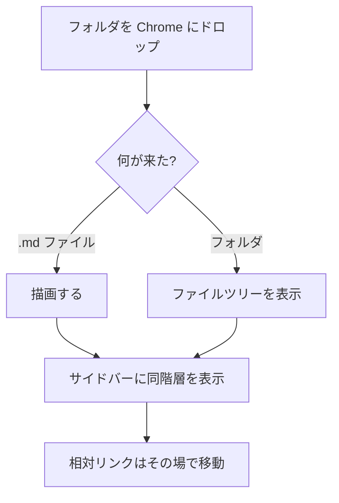
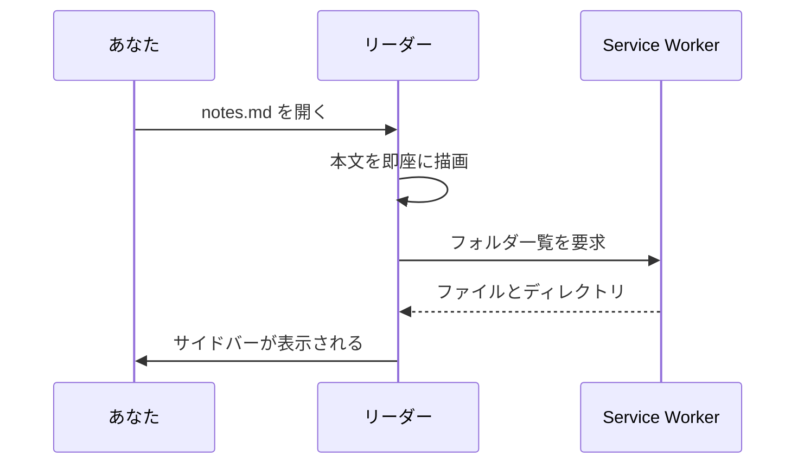

# コード・数式・図

いずれも、ドキュメントが実際にそれを含んでいるときだけ読み込まれます。
普通の文章だけのページは、どれも読み込みません。

## シンタックスハイライト

```typescript
interface FileSource {
  readonly kind: 'handle' | 'file-url' | 'snapshot';
  readonly canPersist: boolean;
  readonly canRefresh: boolean;

  readFile(path: string): Promise<FileContent>;
  listDirectory(path: string): Promise<DirectoryEntry[]>;
}
```

```python
def slugify(text: str) -> str:
    """見出しアンカーは再描画しても変わってはいけない。"""
    return re.sub(r"[^\w\s-]", "", text.lower()).strip().replace(" ", "-")
```

```bash
pnpm install
pnpm dev          # 拡張機能を読み込んだ Chrome を起動
pnpm test         # 369 件のユニットテスト
```

未知の言語はエラーにせず、そのまま表示します:

```notalanguage
書いたとおりに、そのまま残ります
```

## 数式

文中に収まるインライン数式: $E = mc^2$ のように自然に並びます。

ディスプレイ数式は独立した行になります:

$$
\frac{\partial L}{\partial \theta} = \sum_{i=1}^{n} (y_i - \hat{y}_i) x_i
$$

不正な数式はソースを残します — 打ち間違いのせいで書いた内容が消えるほうが、
はるかに悪い失敗だからです。

## 図





解析できない図は、エラーとともにソースを表示します。ドキュメントの他の部分は
影響を受けません。
