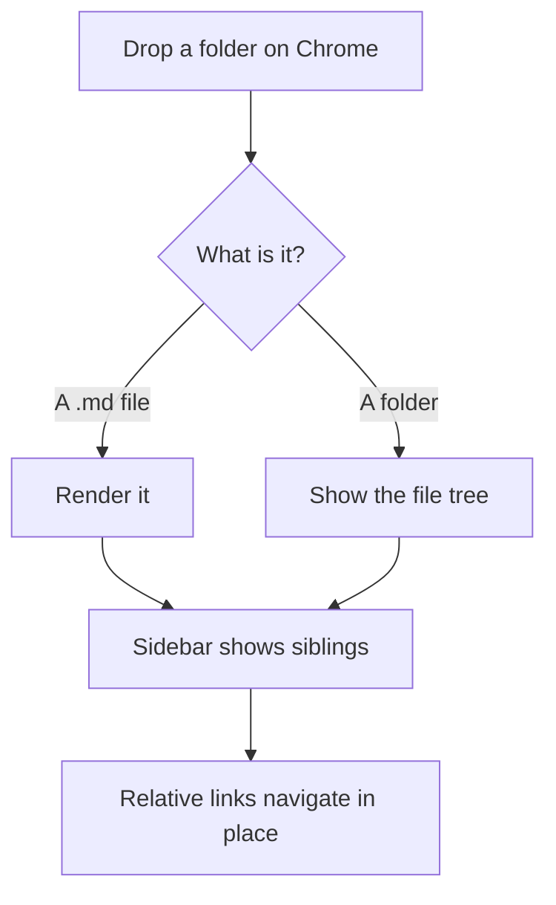
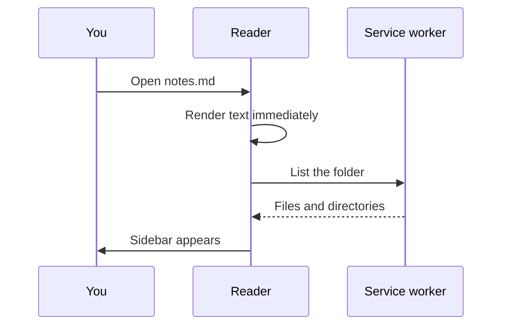

# Code, math and diagrams

Each of these loads only when a document actually contains one. A page of
plain prose downloads none of them.

## Syntax highlighting

```typescript
interface FileSource {
  readonly kind: 'handle' | 'file-url' | 'snapshot';
  readonly canPersist: boolean;
  readonly canRefresh: boolean;

  readFile(path: string): Promise<FileContent>;
  listDirectory(path: string): Promise<DirectoryEntry[]>;
}
```

```python
def slugify(text: str) -> str:
    """Heading anchors must stay stable across renders."""
    return re.sub(r"[^\w\s-]", "", text.lower()).strip().replace(" ", "-")
```

```bash
pnpm install
pnpm dev          # launches Chrome with the extension loaded
pnpm test         # the unit suite
```

An unrecognized language stays plain rather than showing an error:

```notalanguage
this is left exactly as written
```

## Math

Inline math sits in a sentence: $E = mc^2$ reads normally alongside text.

Display math gets its own line:

$$
\frac{\partial L}{\partial \theta} = \sum_{i=1}^{n} (y_i - \hat{y}_i) x_i
$$

Invalid math keeps its source rather than disappearing — losing what you wrote
because of a typo would be the worse failure.

## Diagrams





A diagram that will not parse falls back to showing its source with the error,
and the rest of the document is untouched.

The first diagram carries `accTitle` and `accDescr`. A screen reader announces
a diagram as one image rather than reading its labels one by one — the labels
alone arrive in document order, which for a flowchart is not the order of the
flow. Without those two lines the diagram's own source is offered instead,
which does at least say which node leads to which. A sentence you wrote is
better.
